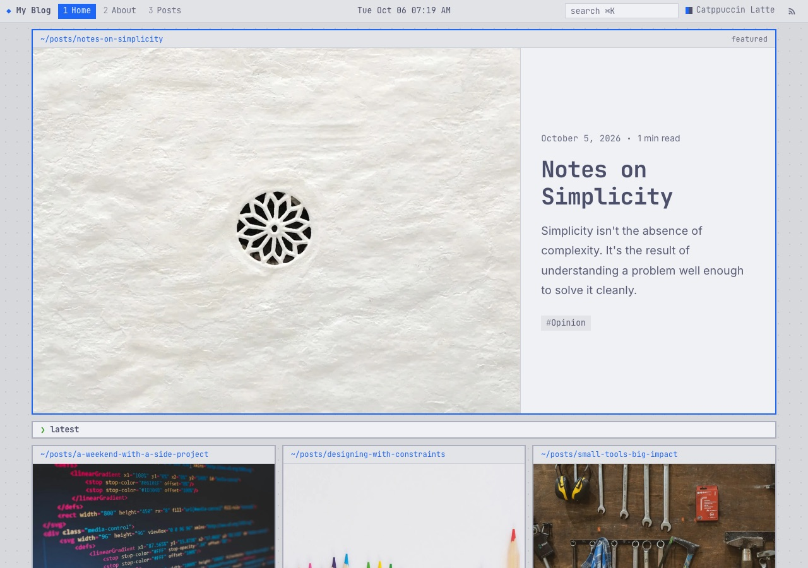
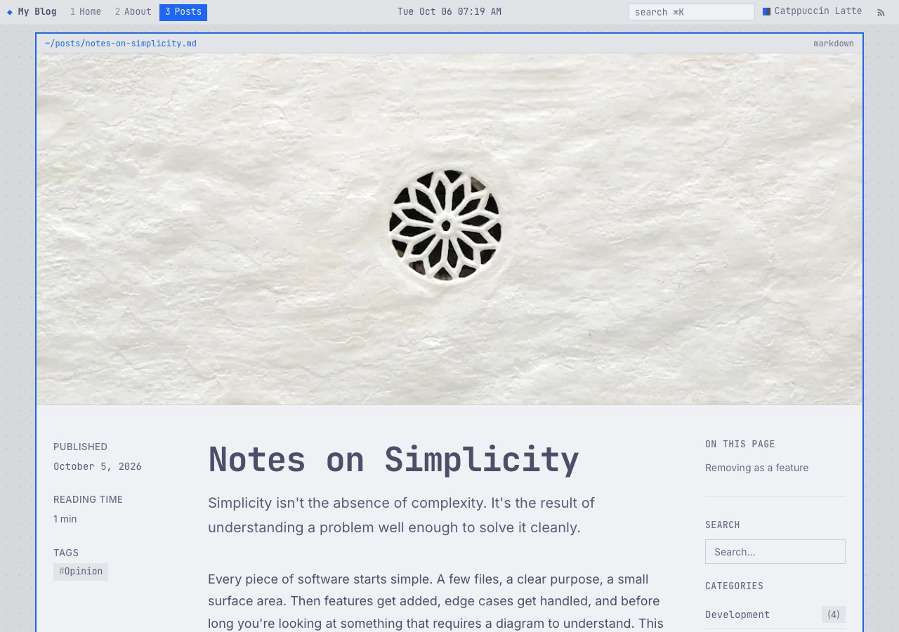
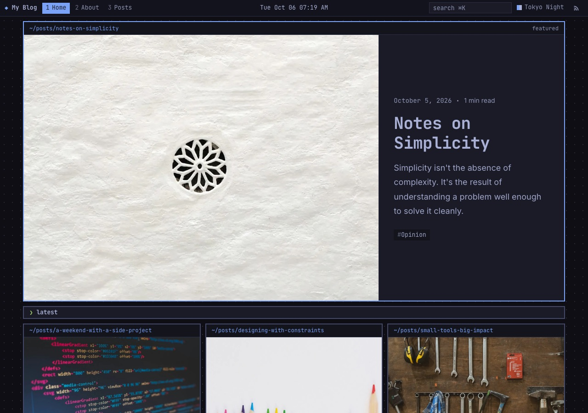
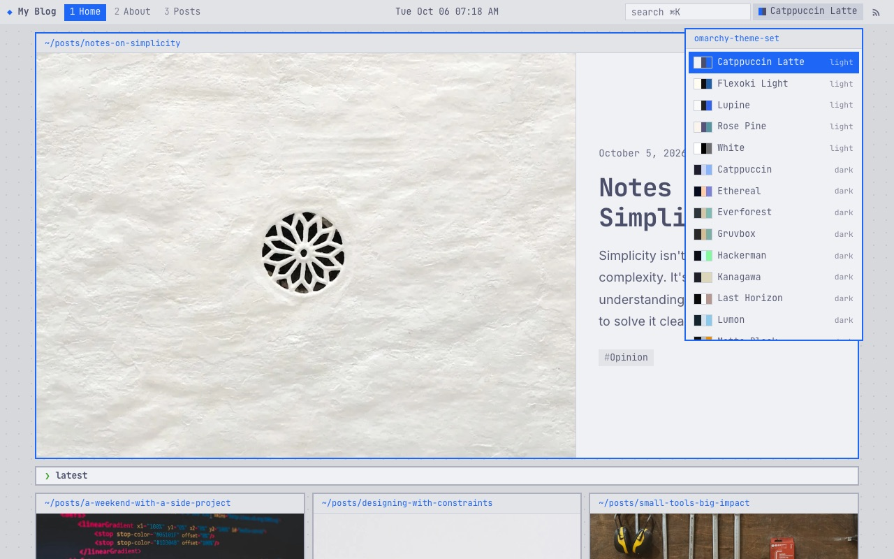
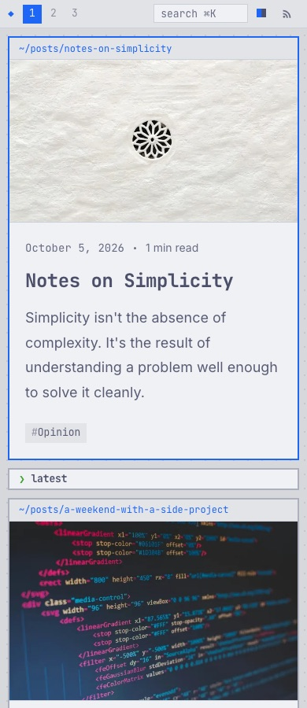

# Omarchy theme for EmDash

An [EmDash](https://github.com/emdash-cms/emdash) blog theme that looks like an [Omarchy](https://omarchy.org) desktop. Pages are Hyprland tiling windows, navigation is a Waybar, and every Omarchy color palette is included, switchable from the top bar.

Runs on Cloudflare Workers with D1 and R2.



## What's included

- **Waybar top bar.** Your EmDash `primary` menu becomes numbered workspaces, with the current page highlighted. It also has a clock, live search (⌘K), the palette picker and RSS.
- **Tiling windows.** Pages are square panes with a title strip (`~/posts/hello.md`) and Omarchy's active-window border on focus. Post lists tile as small windows.
- **All 22 Omarchy palettes.** They are generated from Omarchy's own `colors.toml` files, light and dark. Each uses its own accent and active border, and a visitor's choice is remembered in a cookie.
- **Everything from the EmDash blog template:**
  - featured post
  - post archive with reading time
  - categories and tags
  - search
  - RSS
  - SEO and JSON-LD
  - comments
  - sidebar and footer widgets
- **Monospace chrome, readable body.** JetBrains Mono for the interface and headings, Inter for long-form text.

| Post | Tokyo Night | Palette picker | Mobile |
|---|---|---|---|
|  |  |  |  |

## Create a site from this theme

```bash
pnpm create astro@latest -- --template github:siygle/emdash-theme-omarchy
cd <your-project>
pnpm install
pnpm dev
```

Open http://localhost:4321/_emdash/admin and complete the setup wizard. EmDash runs database migrations and applies the theme's seed (sample posts, pages, menu and widgets) during setup. The site is at http://localhost:4321.

As with every EmDash theme, the files belong to your site after scaffolding. Edit anything.

## Customizing

| What | Where |
|---|---|
| Default palette, palette picker on/off, clock on/off | `src/theme.config.ts` |
| Site title, tagline, logo | EmDash admin → Settings |
| Top bar workspaces and footer links | EmDash admin → Menus → `primary` |
| Footer and sidebar widgets | EmDash admin → Widgets |
| Gaps, border width, fonts, any token | `src/styles/theme.css` (see `src/styles/tokens.css` for the full list) |

### Window panes in your own pages

Any element with a `data-window` attribute becomes a window:

```astro
<section data-window="~/projects" data-window-meta="3 items">
  ...
</section>
```

- `data-window-meta` adds right-aligned text to the title strip.
- `class="is-active"` draws the focused border without hover.
- `class="is-flush"` removes the inner padding, for full-bleed images.
- `class="prompt"` on a heading prefixes it with a green `❯`.

### Updating palettes

The palettes come from [basecamp/omarchy](https://github.com/basecamp/omarchy). To pull new or updated themes:

```bash
pnpm sync-palettes            # latest Omarchy
pnpm sync-palettes <ref>      # or pin an Omarchy tag or commit
```

This rewrites `src/styles/palettes.css` and `src/palettes.ts`. Set `GITHUB_TOKEN` if you hit API rate limits.

## Pages

| Page | Route |
|---|---|
| Homepage | `/` |
| All posts | `/posts` |
| Single post | `/posts/:slug` |
| Category archive | `/category/:slug` |
| Tag archive | `/tag/:slug` |
| Search | `/search` |
| Static pages | `/pages/:slug` |
| 404 | fallback |

## Deploying

```bash
pnpm wrangler login
pnpm deploy
```

The first deployment provisions the D1 database and R2 bucket named in `wrangler.jsonc`. See [Deploy to Cloudflare](https://docs.emdashcms.com/deployment/cloudflare/) for production setup.

## Credits

- Built on the [EmDash blog template](https://github.com/emdash-cms/templates/tree/main/blog-cloudflare) (MIT).
- Palettes from [Omarchy](https://github.com/basecamp/omarchy) by 37signals (MIT). Not affiliated with or endorsed by Omarchy or 37signals.
